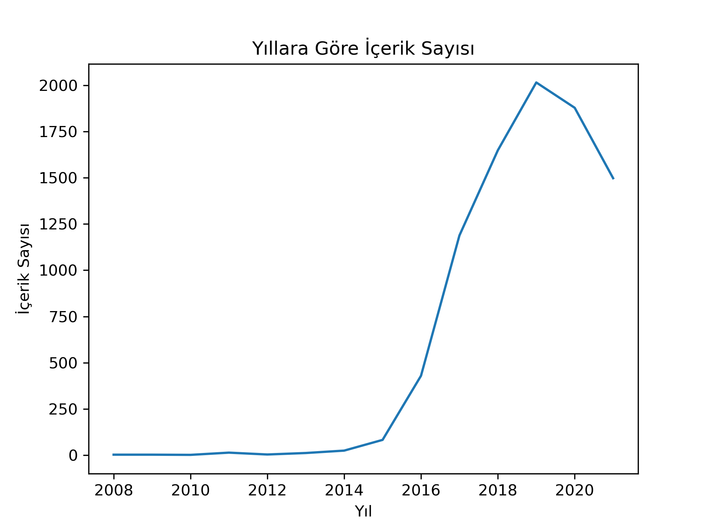
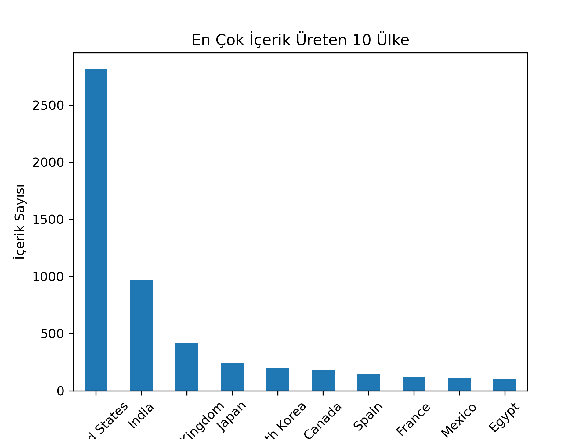
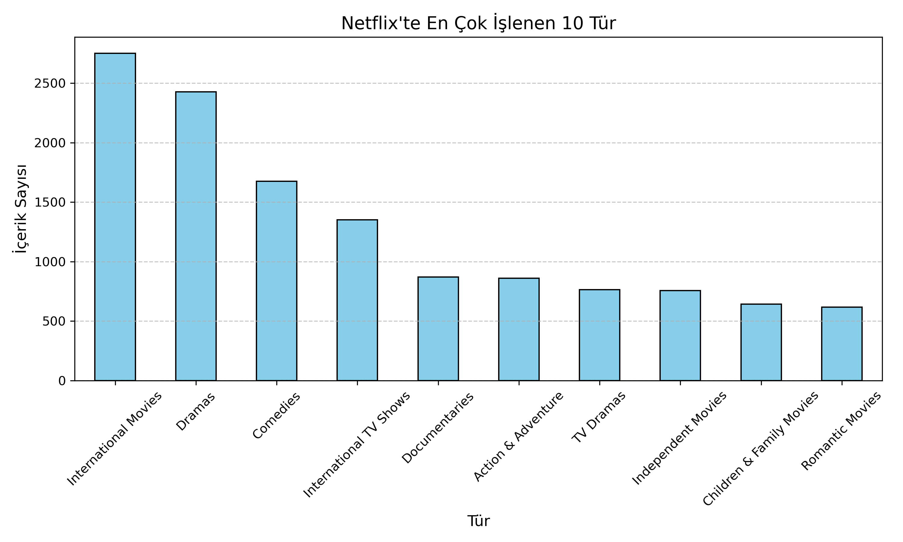

# netflix_analysis
Netflix veri seti ile EDA ve veri görselleştirme
### 1. Yıllara Göre İçerik Sayısı

2010–2014:
İçerik sayısı oldukça düşük.
Bu dönem Netflix’in streaming (yayın) hizmetini yeni yaygınlaştırdığı dönem.
İçerik lisanslama henüz sınırlı.

2015–2019:
İçerik sayısında hızlı bir artış başlıyor.
Netflix bu dönemde orijinal yapımlara ağırlık veriyor: Stranger Things, Narcos gibi yapımlar çıkıyor.
Global pazarlara açılma (Türkiye, Hindistan, Güney Kore) bu dönemde hızlanıyor.

2020 (Zirve):
İçerik sayısında ani bir sıçrama görülür.
Bunun başlıca nedeni:
Pandemi nedeniyle evde kalma süreleri arttı.
Netflix, bu dönemde hem içerik talebini artırdı hem de izleyici kazandı.

2021–2023:
Bazı grafiklerde hafif bir düşüş veya duraklama görülebilir.
Olası nedenler:
Pandemi sonrası üretim yavaşlaması
Pazarın doygunluğa ulaşması
Netflix’in artık daha “nitelikli” ve “bölgesel hedefli” içerik üretme politikası

### 2. En Çok İçerik Üreten Ülkeler

1. ABD (United States):
Netflix içeriğinin açık ara en büyük kısmı ABD kaynaklı.
2818 içerikle, ikinci sıradaki Hindistan’ın neredeyse 3 katı.

2. Hindistan ve Birleşik Krallık:
Hindistan: 972 içerikle öne çıkıyor → Bollywood etkisi çok büyük.
Birleşik Krallık: 419 içerikle üçüncü sırada.

3. "Unknown" – 831 içerik:
Bu, eksik olan ülke verilerinin "Unknown" olarak doldurulmuş hali.
831 içerik çok yüksek → bu içeriklerin kaynağı bilinmiyor.

4. Japonya, Güney Kore, İspanya gibi ülkeler:
Bu ülkeler son yıllarda global Netflix kitlesi için daha fazla içerik üretmeye başladı.
Özellikle K-dramalar (Güney Kore), anime (Japonya), İspanyol dizileri (La Casa de Papel gibi) küresel izlenme etkisi yarattı.

### 3. En Popüler Türler

1. Uluslararası İçeriklerin Egemenliği
İlk 4 sırada “International Movies” ve “International TV Shows” var.
Bu, Netflix’in sadece ABD içeriklerinden oluşmadığını, küresel izleyiciye özel üretimlere ciddi yatırım yaptığını gösteriyor.

Netflix’te en çok yer verilen tür Uluslararası Filmlerdir (2.752 içerik). Bu, platformun sadece ABD değil, farklı ülkelerden içerikleri ön plana çıkardığını gösteriyor.

3. Dramlar En Baskın Türlerden
Dramas ve TV Dramas toplamda 3.000’den fazla içerikle en yaygın anlatı türü.

Dramalar (2.427) ve Komediler (1.674) ise evrensel izleyici kitlesine hitap eden içeriklerin önemini ortaya koyuyor.

5. Komedi ve Romantizm Sabit Tercihler
İnsanlar günlük hayatta rahat içerik ararken komedi ve romantizm türlerine yöneliyor.

6. Belgesel ve Aile İçeriği
Netflix sadece eğlence değil, bilgilendirme ve aile eğitimi alanında da içerik sunuyor.
Bu durum platformun farklı yaş gruplarına ulaşma isteğini gösteriyor.

Uluslararası Diziler, Belgeseller ve Aile Filmleri, Netflix’in içerik stratejisinin çeşitliliğe verdiği önemi göstermektedir.
Platform hem eğlendirici hem de bilgilendirici içerikleri bir arada sunarak çok yönlü bir yayın hizmeti sunuyor.

